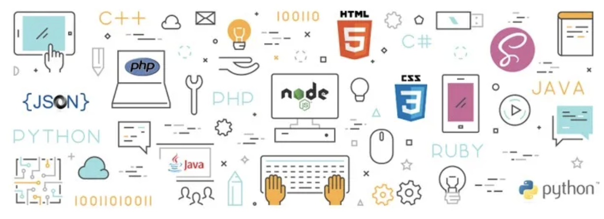

THE LANGUAGE of LIFE EXPECTANCY: 

A Natural Language Processing Approach to Evaluating GitHub Repository Content Programming Language
 
===
        
Team Members: Chris Teceno, Rachel Robbins-Mayhill, Kristofer Rivera   |   Codeup   |   Innis Cohort   |   May 2022
 
===

 

Table of Contents
---
 
* I. [Project Overview](#i-project-overview) 
[1. Goal](#1-goal) 
[2. Description](#2-description) 
[3. Initial Questions](#3initial-questions) 
[4. Formulating Hypotheses](#4-formulating-hypotheses) 
[5. Deliverables](#5-deliverables) 
* II. [Project Data Context](#ii-project-data-context) 
[1. Data Dictionary](#1-data-dictionary) 
* III. [Project Plan - Data Science Pipeline](#iii-project-plan---using-the-data-science-pipeline) 
[1. Project Planning](#1-plan) 
[2. Data Acquisition](#2-acquire) 
[3. Data Preparation](#3-prepare) 
[4. Data Exploration](#4explore) 
[5. Modeling & Evaluation](#5-model--evaluate) 
[6. Product Delivery](#6-delivery) 
* IV. [Project Modules](#iv-project-modules) 
* V. [Project Reproduction](#v-project-reproduction) 
 
 
 
## I. PROJECT OVERVIEW

#### 1. GOAL:
The goal of this project is to build a Natural Language Processing model that can predict the programming language of projects within specified GitHub repositories, given the text of a README.md file. 
 
 
#### 2. DESCRIPTION:
This project was initiated by utilizing web scraping techniques to scrape README files from specified GitHub repositories focused on Life Expectancy projects. The 130 most starred Life Expectancy Repositories, as of May 14, 2022, were used as the documents within the corpus for this NLP project. 

After acquiring and preparing the corpus, our team conducted natural language processing exploration methods such as word clouds, bigrams, and trigrams. We employed multiclass classification methods to create multiple machine learning models. The end goal was to create an NLP model that accurately predicted the programming language used in a GitHub repository based on the words and word combinations found in the readme files. 
 
 
 
#### 3.INITIAL QUESTIONS:
The focus of the project is on identifying the programming language within GitHub repositories. Below are some of the initial questions this project looks to answer throughout the Data Science Pipeline.
 
##### Data-Focused Questions
- What are the most frequently occuring words?
- Are there any words that uniquely identify one of the coding langauges?
- What are the most frequently occuring bigrams?
- Are there any bigrams that uniquely identify one of the coding langauges?
- Is word count within the README significantly different between the top 4 programming langauges?
 
 
##### Overall Project-Focused Questions
- What will the end product look like?
   + A finalized Jupyter Notebook that contains the analysis for the project.
   + A README File that contains a description of the project and instructions on how to run it. 
   + 2-5 Google Slides that summarize exploratory findings and modeling results, linked in the README. 
- What format will it be in?
   + Slide format, with agenda, executive summary, corpus overview, and modeling results, along with the Github Repo.
- Who will it be delivered to?
   + A General Audience
- How will it be used?
   + To display a process that can be duplicated to use Natural Language Processing to sift through large amounts of text in order to classify the text.
- How will we know we're done?
   + When a model is constructed that can predict accurate programming language better than baseline in addition to deliverables being complete.
- What is our MVP?
   + Work through the Data Science Pipeline to produce ONE single model that performs better than baseline to accurately predict the programming language. 
- How will we know it's good enough?
   + If the exploratory process delivers data-backed insights and the modeling process produces a model to perform better than baseline. 
 
 
#### 4. FORMULATING HYPOTHESES
- Which programming language __________?
   + H0: .
   + H1: .
 
 
#### 5. DELIVERABLES:
- [x] README file - provides an overview of the project and steps for project reproduction
- [x] Draft Jupyter Notebook - provides all steps taken to produce the project
- [x] wrangle.py - provides reproducible code to automate acquiring, preparing, and splitting the corpus
- [x] Report Jupyter Notebook - provides final presentation-ready wrangle, exploration, modeling, and summary
- [x] 2-5 Slide Slide Deck - includes 2 visualizations and an executive summary with recommendations and next steps

 
 
## II. PROJECT DATA CONTEXT
 
#### 1. DATA DICTIONARY:
The final DataFrame used to explore the corpus for this project contains the following variables (columns).  The variables, along with their data types, are defined below:
 
 
|  Variables             |    Definition                              |    DataType             |
| :--------------------   | :---------------------------------------- | :-------------------- |
repo                  | The name of the specific repository                     | object
language              | The primary programming language of the repository      | object
original              | The contents of scraped readme file within the repo     | object
more_clean*           | The readme contents cleaned with prep_data function     | object
unique_words*         | The number of unique words in the more_clean document   | object
char_count*           | The number of characters within the more_clean document | object
word_count*           | The number of words within the more_clean document      | object
unique_word_count*    | The number of unique words in the more_clean document   | object
most_common_word*     | The word that occured most within the document          | object
2nd_most_common_word* | The 2nd most commonly occuring word within the document | object
3rd_most_common_word* | The 3rd most commonly occuring word within the document | object
4th_most_common_word* | The 4th most commonly occuring word within the document | object
5th_most_common_word* | The 5th most commonly occuring word within the document | object
 
* feature engineered
 
## III. PROJECT PLAN - USING THE DATA SCIENCE PIPELINE:
The following outlines the process taken through the Data Science Pipeline to complete this project. 
 
Plan➜ Acquire ➜ Prepare ➜ Explore ➜ Model & Evaluate ➜ Deliver
 
#### 1. PLAN
- [x]  Review project expectations
- [x]  Draft project goal to include measures of success
- [x]  Create questions related to the project
- [x]  Create questions related to the corpus
- [x]  Create a plan for completing the project using the data science pipeline
- [x]  Create a data dictionary framework to define variables and data context
- [x]  Draft starting hypothesis
 
#### 2. ACQUIRE
- [x]  Create .gitignore
- [x]  Create env file with log-in credentials for GitHub
- [x]  Store env file in .gitignore to ensure the security of sensitive data
- [x]  Create wrangle.py module
- [x]  Store functions needed to acquire the README documents for >= 100 GitHub repositories
     - [x] Copy & Paste >= 100 repo names from GitHub into the REPOS variable in the wrangle.py module 
- [x]  Ensure all imports needed to run the acquire functions are inside the wrangle.py document
- [x]  Using Command Line / Terminal, run ‘python acquire.py’ to create the `data.json` file that contains the corpus
- [x]  Using Jupyter Notebook or other Python Scripting Program
     - [x]  Run all required imports
     - [x]  Import functions for acquiring the corpus from wrangle.py module
     - [x]  Obtain the original size of the corpus
     
 
#### 3. PREPARE
Using Jupyter Notebook
- [x]  Acquire corpus using functions from the wrangle.py module
- [x]  Summarize corpus using methods and document observations
- [x]  Clean documents/corpus
   - [x] Make all text lowercase
   - [x] Normalize, encode, and decode to remove accented text and special characters
   - [x] Tokenize strings to break words and punctuation into discrete units
   - [x] Stem or Lemmatize words to acquire base words
   - [x] Remove stopwords
- [x]  Address missing values, data errors, unnecessary data, renaming
- [x]  Split corpus into train, validate, and test samples
Using Python Scripting Program (Jupyter Notebook)
- [x]  Create prepare functions within wrangle.py
- [x]  Store functions needed to prepare the GitHub Repository Corpus such as:
   - [x]  Cleaning Function: to normalize text and remove accented and special characters
   - [x]  Tokenize Function: to break strings down into discrete units
   - [x]  Stem Function: to acquire root words
   - [x]  Lemmatize Function: to acquire lexicographically correct root words
   - [x]  Stopwords Function: to remove meaningless words
- [x]  Ensure all imports needed to run the prepare functions are added to the wrangle.py document

 
#### 4.EXPLORE
Using Jupyter Notebook:
- [x]  Answer key questions about hypotheses 
- [x]  Create visualizations with the intent to discover variable relationships
     - [x]  Identify variables related to programming langauge
     - [x]  Identify any potential data integrity issues
- [x]  Document findings
- [x]  Summarize conclusions, provide clear answers, and summarize takeaways
     - [x] Explain plan of action as deduced from work to this point
 
#### 5. MODEL & EVALUATE
Using Jupyter Notebook:
- [x] Establish baseline accuracy
- [x] Train and fit multiple (3+) models with varying algorithms and/or hyperparameters
- [x] Compare evaluation metrics across models
- [x] Remove unnecessary features
- [x] Evaluate best performing models using validate set
- [x] Choose best performing validation model for use on test set
- [x] Test final model on out-of-sample testing corpus
- [x] Summarize performance
- [x] Interpret and document findings
 

#### 6. DELIVERY
- [x]  Prepare a presentation using Google Slides, containing 2-5 slides
     - [x]  Include an introduction of the project and goals
     - [x]  Provide an executive summary of findings, key takeaways, recommendations, and next steps
     - [x]  Create a walkthrough of the exploration analysis 
     - [x]  Include 2+ presentation-worthy visualizations that support exploration and modeling
     - [x]  Provide final takeaways, recommend a course of action for modeling, and next steps
- [x]  Prepare final notebook in Jupyter Notebook
     - [x]  Create clear walk-though of the Data Science Pipeline using headings and dividers
     - [x]  Explicitly define questions asked during the initial analysis
     - [x]  Visualize relationships
     - [x]  Document takeaways
     - [x]  Comment code thoroughly

 
 
## IV. PROJECT MODULES:
- [x] wrangle.py - provides reproducible python code to automate acquiring, preparing, and splitting the corpus
 
  
## V. PROJECT REPRODUCTION:
### Steps to Reproduce
- [x] Create an env.py file that contains access credentials to GitHub in the form of github_token and github_username variables
- [x] You will need a GitHub personal access token in place of a password in order to access the contents within GitHub
     - [x] Go here and generate a personal access token: https://github.com/settings/tokens
     - [x] You do _not_ need to select any scopes, i.e. leave all the checkboxes unchecked
     - [x] Save the token in your env.py file under the variable `github_token`
- [x] Add your GitHub username to your env.py file under the variable `github_username`
- [x] Store that env file locally in the repository
- [x] Make .gitignore and confirm .gitignore is hiding your env.py file
- [x] Clone our repo (including the wrangle.py)
- [x] Import python libraries:  pandas, matplotlib, seaborn, numpy, sklearn, nltk, json, re, and unicodedata
- [x] Follow steps as outlined in the README.md. and work.ipynb
- [x] Run Final_Report.ipynb to view the final product
